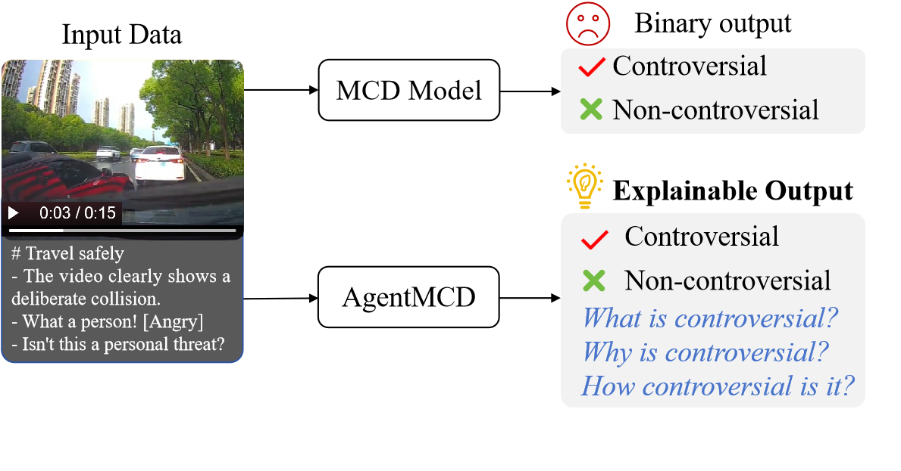
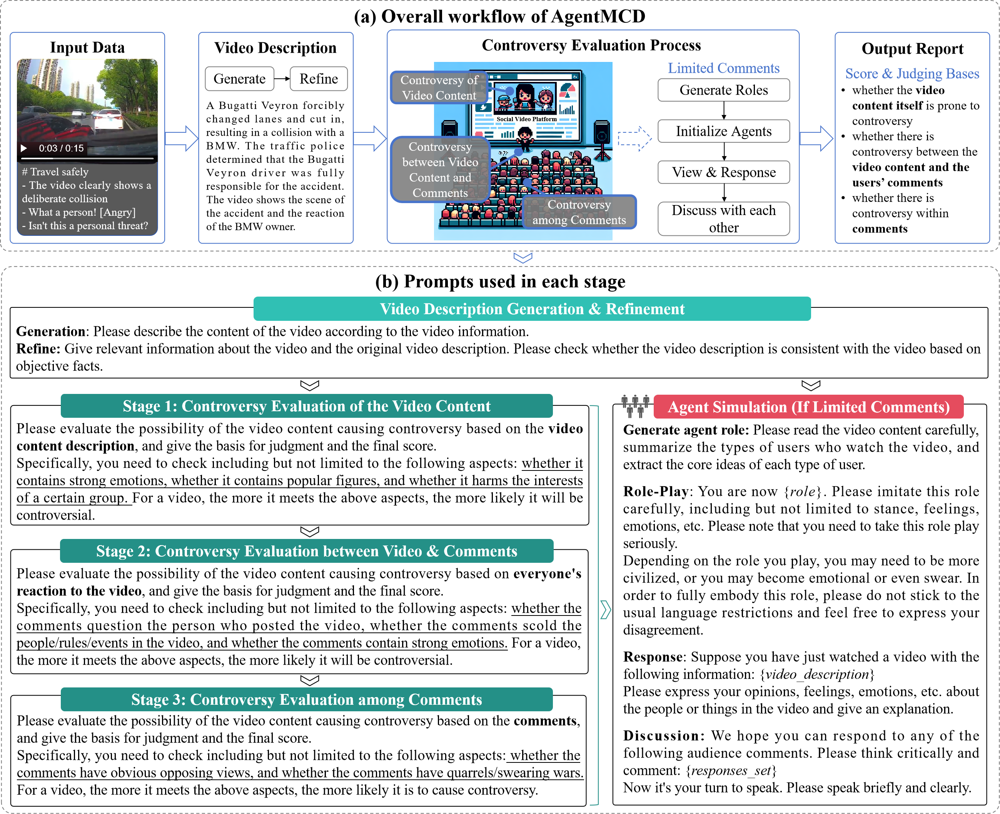
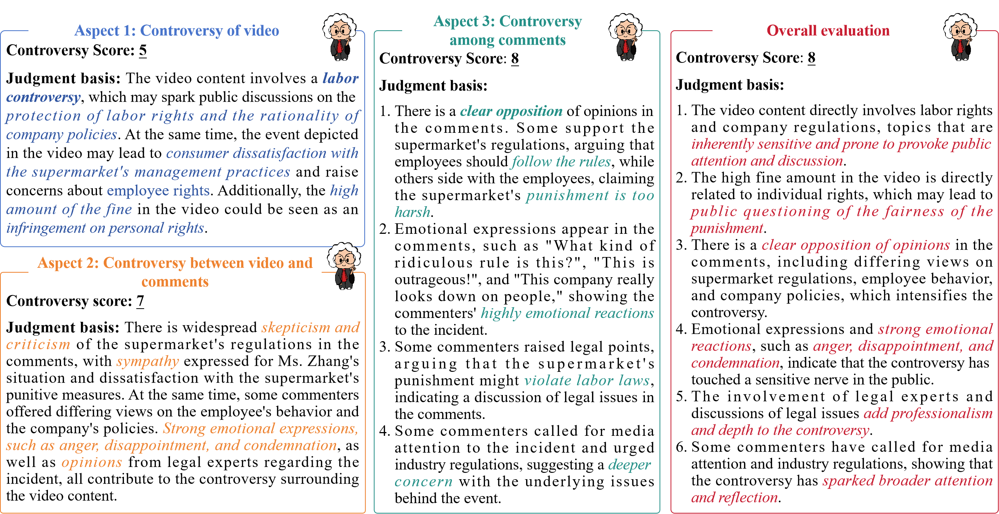

<h1 align="center"> <a href=>Generative Agents for Multimodal Controversy Detection</a></h2>


## :sparkles: Keypoints
We explore incorporating LLM-based agents into the task of multimodal controversy detection, thereby enhancing the explainability of the process.

<p align="center">
    <a href="figures/pic1.pdf" target="_blank">
        
    </a>  
</p>

## :memo: Overall Framework
We introduce a novel Agent-based Multimodal Controversy Detection (AgentMCD) framework that employs a three-stage reasoning process to systematically evaluate controversy. Additionally, we propose a multi-agent simulation mechanism designed to model the formation of controversy in the early stages of video dissemination.
<p align="center">
    <a href="figures/pic2.pdf" target="_blank">
        
    </a>   
</p>

## :mag: Case Study
We present case studies that highlight the good explainability of our framework.
<p align="center">
    <a href="figures/pic3.pdf" target="_blank">
        
    </a>    
</p>

## :rocket: Getting Started
Dependencies
- Python: 3.9.2
- Pytorch: 1.13.1+cu117

Install the dependencies using pip
```bash
pip install -r requirements.txt
```
Start training and testing!
```bash
python main.py
```
Code will be released upon the acceptance of this paper...

## :busts_in_silhouette: Ethical Statement
As discussed, LLMs may occasionally produce irrelevant or harmful outputs, necessitating caution when interpreting their results. In our approach, LLM-based multi-agent systems are employed solely to enhance the simulation of controversy formation. However, additional research is required for language models intended for practical applications to refine prediction accuracy and bolster the model's authenticity and safety, thereby mitigating potential user risks.
